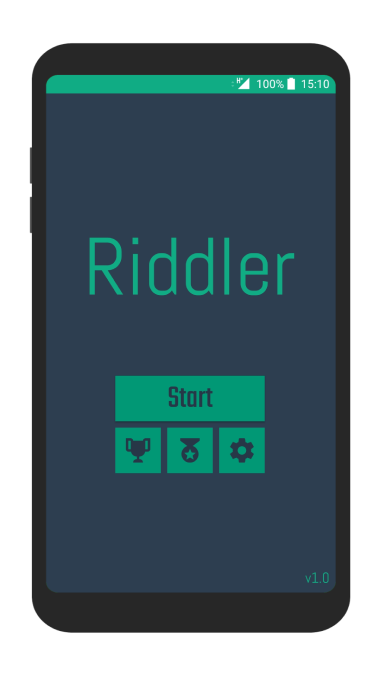
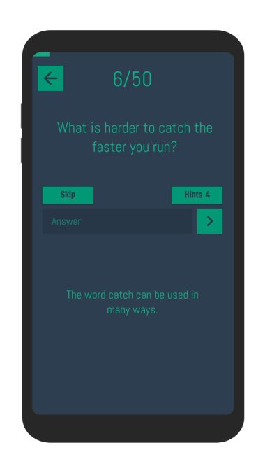
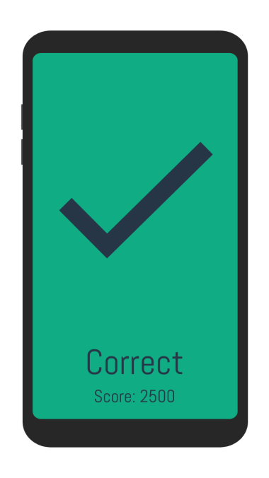

# Riddler for Android

Riddler is a riddle game built as a native Android app in Java using XML for the UI. It includes 50 challenging riddles with hints for when you get stuck. The game tracks your stats so you can compare your performance against your friends, and see who can answer all 50 riddles the quickest.

Check it out on the [Play Store](https://play.google.com/store/apps/details?id=co.stenning.riddler).

## Note
> This respository will not compile out of the box. Some files are not included due to including confidential information, such as private keys.

## Features
- UI built using XML
- JSON data parsing for persistant user data storage
- Achievements and leaderboards implemented using Google Play Games
- Privacy consent collection using Google User Messaging Platform
- Interstitial and rewarded ads using AdMob
- Firebase analytics and crashyltics for stability monitoring

## How it looks...

  
   
  

